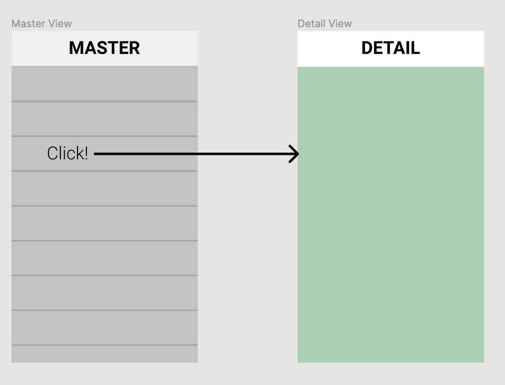
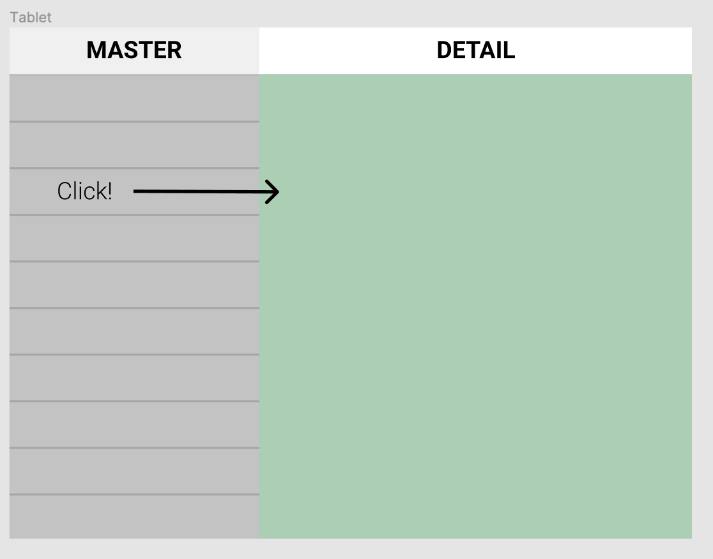

# WIZMasterDetail
MasterDetail scheme on Dart (with auto focused list)

MasterDetail looks like SplitViewController in iOS.<br> 
A container that includes two controllers: a navigation controller and, corresponding to the choice, an information one. It change own representation denending on screen size. 
<br>
For example:
<br>
***Phone***
<br>

<br><br>
***Tablet***
<br>


## How to use
1 - create Master Controller inherited *MasterWidget*<br>
&nbsp; a) add AppBar<br>
&nbsp; b) add itemCount<br>
&nbsp; c) add builder<br>
<br>
*Example*
```
MyMaster({@required this.inputArray, bool isTablet}) : super(
    appBar: _createAppBar(isTablet),
    itemCount: inputArray.length,
    builder: (index, selected, onTap) {
      return MyCell(
        order: inputArray[index],
        onTap: () {
          onTap(index);
        },
        isSelected: selected,
      );
    }
  );
```
<br>
2 - create Detail Controller inherited *DetailWidget*<br>
&nbsp; a) override selectRow(int row)<br>
&nbsp; b) override copy()<br>
&nbsp; c) add container<br>
<br>
*Example*

``````
class MyDetail extends DetailWidget {

  final ContainerForDetail _dataContainer = new ContainerForDetail();

  @override
  void selectRow(int row) {
    _dataContainer.reloadContainerWithData(row);
  }

  @override
  DetailWidget copy() {
    return new ContainerForDetail();
  }

  @override
  Widget build(BuildContext context) {
    return Container(
      child: _dataContainer
    );
  }
}
``````

<br>
3 - create Controller with *MasterDetailContainer*
<br>
*Example*

``````

return Scaffold(
              body: MasterDetailContainer(
                master: MyMaster(
                  inputArray: inputArray,
                  isTablet: isTablet,
                ),
                detail: MyDetail(),
              )
          );
``````
